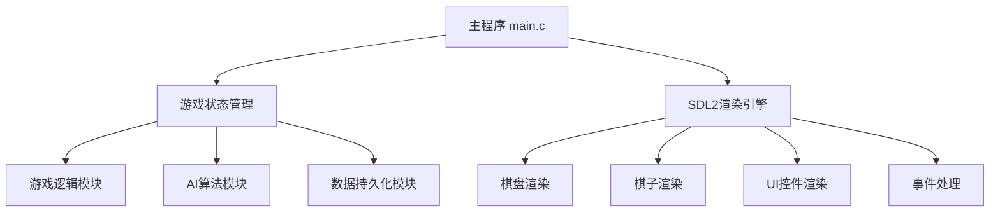

## 产品概述

使用C语言和SDL2图形库开发一款功能完整的五子棋游戏，支持人人对战和人机对战，运行于Windows平台（MinGW GCC编译）。

## 核心功能

- **人人对战**：两名玩家轮流在15×15棋盘上落子，先连成五子者获胜
- **人机对战**：玩家与AI对战，AI采用Minimax博弈树+Alpha-Beta剪枝算法，具备较强对弈水平
- **悔棋功能**：支持撤回上一步落子，可连续悔棋
- **保存/加载棋局**：将当前棋局保存为文本文件，支持从文件加载棋局继续对战
- **落子动画效果**：落子时有视觉反馈动画，提升用户体验
- **图形界面**：使用SDL2渲染棋盘、棋子及UI元素，支持鼠标交互

## 技术栈选择

- **编程语言**：C99（兼容MinGW GCC）
- **图形库**：SDL2（跨平台，对MinGW支持良好，社区资源丰富）
- **编译器**：MinGW GCC
- **数据持久化**：文本文件格式（便于调试和人工查看）

## 实现方案

### 总体策略

采用模块化分层架构，将游戏逻辑、AI算法、图形渲染、数据持久化分离，确保代码可维护性和可扩展性。

### 关键技术方案

#### 1. 棋盘与游戏逻辑

- 使用15×15二维数组表示棋盘，0=空，1=黑子，2=白子
- 每次落子后，从落子点向8个方向（横、竖、两条对角线）扫描，判断是否连成五子
- 支持落子历史栈，实现悔棋功能

#### 2. AI算法（Minimax + Alpha-Beta剪枝）

- **博弈树搜索**：递归搜索可能的落子位置，深度可配置（建议3-4层）
- **Alpha-Beta剪枝**：大幅减少搜索空间，提升AI响应速度
- **启发式评估函数**：
- 评估当前局面对当前玩家的优势
- 考虑活四、冲四、活三、冲三、活二等棋型
- 攻击权重 > 防守权重，体现进攻性
- **落子点排序优化**：优先搜索棋盘中心区域和已有棋子附近的位置，提升剪枝效率
- **时间复杂度**：O(b^(d/2))（经Alpha-Beta剪枝后），其中b为分支因子，d为搜索深度

#### 3. 图形渲染（SDL2）

- **棋盘渲染**：绘制木质纹理背景+网格线
- **棋子渲染**：黑子（纯黑+高光效果）、白子（纯白+阴影效果）
- **落子动画**：棋子从透明到不透明+缩放效果的过渡动画（使用SDL2定时器+渐变渲染）
- **UI元素**：按钮（新游戏、悔棋、保存、加载、切换模式）、当前玩家提示、胜负提示弹窗
- **鼠标交互**：鼠标悬停高亮、点击落子

#### 4. 数据持久化

- 保存格式：纯文本文件（.txt），包含棋盘状态、当前玩家、游戏模式
- 加载时解析文件，恢复棋盘状态和游戏进度

### 实现要点

- **性能优化**：
- AI搜索时只对棋盘上已有棋子周围空位进行搜索（减少分支因子）
- 使用位运算优化连五判断（可选，进阶优化）
- 落子动画使用轻量级SDL2定时器，避免阻塞主循环
- **错误处理**：
- 文件操作失败时的用户提示
- 内存分配失败的检查
- SDL初始化失败的处理
- **代码规范**：
- 遵循C99标准，使用snake_case命名
- 每个模块有清晰的头文件和实现文件
- 使用静态函数限制作用域

## 架构设计

### 系统架构图



### 模块划分

- **主程序模块**：程序入口，初始化SDL2，运行主循环
- **游戏状态管理模块**：管理游戏状态机（菜单、进行中、结束）
- **游戏逻辑模块**：棋盘操作、落子判定、胜负判定、悔棋逻辑
- **AI算法模块**：Minimax搜索、Alpha-Beta剪枝、局面评估
- **渲染模块**：棋盘绘制、棋子绘制、动画效果、UI绘制
- **事件处理模块**：鼠标/键盘事件处理
- **数据持久化模块**：保存/加载棋局文件

## 目录结构

```
d:/Projects/wuziqi_ai/
├── main.c                  # [NEW] 程序入口，SDL2初始化，主循环
├── Makefile                # [NEW] MinGW GCC编译配置
├── README.md               # [NEW] 项目说明文档
├── include/
│   ├── game.h              # [NEW] 游戏状态定义、全局常量、函数声明
│   ├── board.h             # [NEW] 棋盘操作接口：初始化、落子、悔棋、胜负判定
│   ├── ai.h                # [NEW] AI算法接口：Minimax搜索、评估函数
│   ├── render.h            # [NEW] SDL2渲染接口：绘制棋盘、棋子、UI
│   ├── event.h             # [NEW] 事件处理接口：鼠标/键盘事件
│   └── save_load.h         # [NEW] 数据持久化接口：保存/加载棋局
├── src/
│   ├── board.c             # [NEW] 棋盘逻辑实现：15×15数组操作、连五判定、悔棋栈
│   ├── ai.c                # [NEW] AI算法实现：Minimax+Alpha-Beta、评估函数、落子点生成
│   ├── render.c            # [NEW] 渲染实现：SDL2绘制、动画效果、纹理管理
│   ├── event.c             # [NEW] 事件处理实现：鼠标点击坐标转换、按钮事件
│   └── save_load.c         # [NEW] 持久化实现：文件读写、格式解析
├── assets/
│   ├── board_bg.bmp        # [NEW] 棋盘背景纹理（可选，也可用代码绘制）
│   └── font.ttf            # [NEW] 字体文件（用于UI文字渲染）
└── saves/
    └── .gitkeep            # [NEW] 保存文件的默认目录
```

## 关键代码结构

### 核心数据结构

```c
// 游戏模式枚举
typedef enum {
    MODE_PVP,      // 人人对战
    MODE_PVE       // 人机对战
} GameMode;

// 游戏状态枚举
typedef enum {
    STATE_MENU,    // 主菜单
    STATE_PLAYING, // 游戏中
    STATE_WIN      // 游戏结束
} GameState;

// 棋盘结构体
typedef struct {
    int grid[15][15];        // 棋盘数组
    int current_player;       // 当前玩家（1=黑，2=白）
    int move_history[225][2]; // 落子历史（最多225步）
    int move_count;           // 已落子数量
} Board;

// 游戏上下文结构体
typedef struct {
    Board board;
    GameMode mode;
    GameState state;
    int winner;               // 获胜者
    SDL_Texture* black_piece; // 黑子纹理
    SDL_Texture* white_piece; // 白子纹理
} GameContext;
```

### AI核心接口

```c
// AI执行落子，返回最佳落子坐标(row, col)
void ai_make_move(Board* board, int* row, int* col);

// Minimax搜索函数
int minimax(Board* board, int depth, int alpha, int beta, int is_maximizing);

// 局面评估函数
int evaluate_board(Board* board, int player);
```